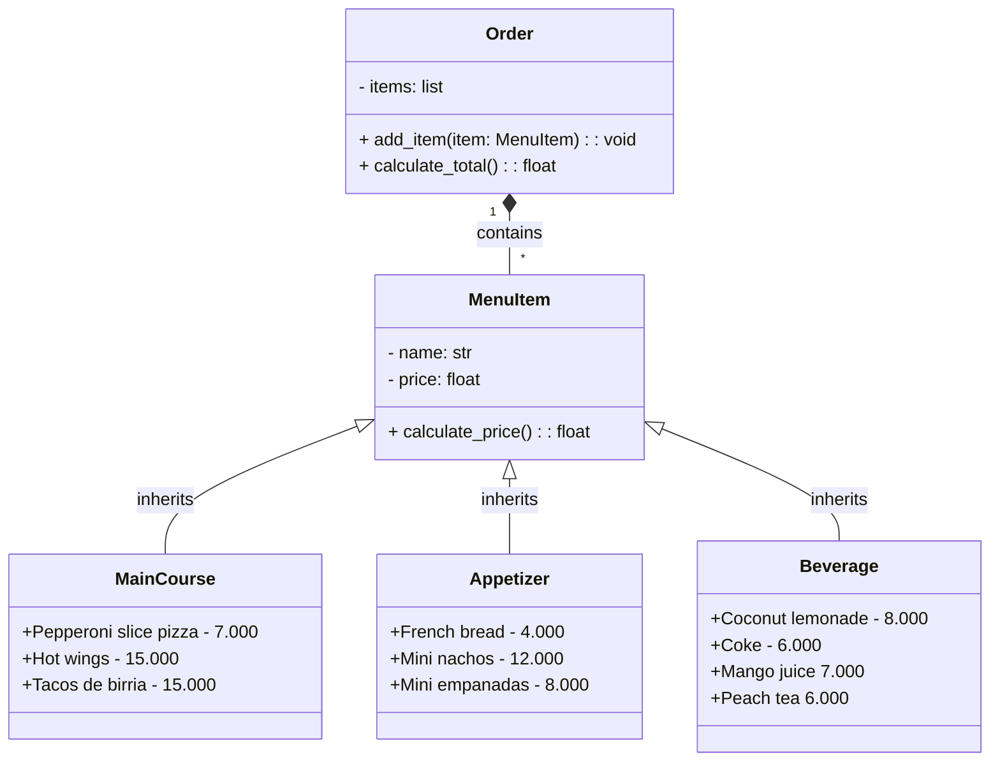

# Rectanurant:(
_I almost lost my mind doing this... sometimes I just don't have enough by making things easier and that made me have some trouble._
***
### Better Comments
_This is the how I decided to use the extension._
- #Info related to the program (grey)
- #* Titles (green light)
- #? Advices or clarifications (blue)
- #todo Need to reforce (orange)
- #! Confused bout' something (red)
- #// Discarted (--)
- #- Success (yellow)
***
## 1. Rectangle
This code made me tocuh hell a little bit and the reason is just too simple: I complicated symple things.

```python
import math

#* Line
# Just practicing with classes, objects and inheritance

class Point:
    def __init__(self, x, y):
        self.x = x
        self.y = y

def get_point():
    # Prompt the user to enter the coordinates of a point
    x = float(input("Enter the x-coordinate of the point: "))
    y = float(input("Enter the y-coordinate of the point: "))
    return Point(x, y)

class Line:
    def __init__(self, start: Point, end: Point):
        self.st = start
        self.e = end

    def compute_length(self):
        #? Compute the length of the line using the distance formula
        length = math.sqrt((self.e.x - self.st.x)**2 + (self.e.y - self.st.y)**2)
        return length

    def compute_slope(self):
        if self.e.x - self.st.x == 0:
            print("You can't divide by zero\n")
        elif self.st.x == self.e.x and self.st.y == self.e.y:
            print("You are writting a point, not a line\n")
        else:
            #? Compute the slope of the line using the formula
            slope = (self.e.y - self.st.y)/(self.e.x - self.st.x)
            #? Convert the slope to degrees by using the arctan function
            angle_degrees = math.degrees(math.atan(slope))
            print(f"The slope of the line is: {angle_degrees}\n")

    def compute_horizontal_cross(self):
        if self.st.y == 0 or self.e.y == 0:
            print("There is horizontal cross\n")
        else:
            print("There is no horizontal cross\n")

    def compute_vertical_cross(self):
        if self.st.x == 0 or self.e.x == 0:
            print("There is vertical cross\n")
        else: 
            print("There is no vertical cross\n")

    def discretize_line(self, n):
        #? Divide the line into n equal segments
        dx = (self.e.x - self.st.x) / n
        dy = (self.e.y - self.st.y) / n
        self.points = [(self.st.x + i * dx, self.st.y + i * dy) for i in range(n+1)]

class Rectangle:
    def __init__(self, width:float = None, height:float = None, bottom_left_corner:Point = None, center:Point = None, upper_right_corner:Point = None, line1:Line = None, line2: Line = None):
        self.w = width
        self.h = height
        self.blc = bottom_left_corner
        self.c = center
        self.urc = upper_right_corner
        self.l1 = line1
        self.l2 = line2

    def Rectangle_creation(self, method):
        if method == 1:
            print("Enter the data of the rectangle: ")
            pointBL = get_point()
            width = float(input("Enter the width of the rectangle: "))
            height = float(input("Enter the height of the rectangle: "))
            my_rectangle = Rectangle(width, height, pointBL)
            response = input("Do you want to see the Data registered? (y/n): ")
        
            if(response == "y"):
                print(f"\nThe bottom left corner of the rectangle is: ({my_rectangle.blc.x}, {my_rectangle.blc.y})")
                print(f"\nThe width of the rectangle is: {my_rectangle.w}")
                print(f"\nThe height of the rectangle is: {my_rectangle.h}")
            else:
                print("Ok, bye!")
            return my_rectangle
            
        elif method == 2:
            print("Enter the data of the rectangle: ")
            center = get_point()
            width = float(input("\nEnter the width of the rectangle: "))
            height = float(input("\nEnter the height of the rectangle: "))
            my_rectangle = Rectangle(width, height, None, center)
            response = input("Do you want to see the Data registered? (y/n): ")

            if(response == "y"):
                print(f"\nThe center of the rectangle is: ({my_rectangle.c.x}, {my_rectangle.c.y})")
                print(f"\nThe width of the rectangle is: {my_rectangle.w}")
                print(f"\nThe height of the rectangle is: {my_rectangle.h}")
            else:
                print("Ok, bye!")
            return my_rectangle

        elif method == 3:
            print("Enter the data of the rectangle: ")
            pointBL = get_point()
            pointUR = get_point()
            my_rectangle = Rectangle(None, None, pointBL, None, pointUR)

            response = input("Do you want to see the Data registered? (y/n): ")
            if response == "y":
                print(f"\nThe bottom left corner of the rectangle is: ({my_rectangle.blc.x}, {my_rectangle.blc.y})")
                print(f"\nThe upper right corner of the rectangle is: ({my_rectangle.urc.x}, {my_rectangle.urc.y})")
            else:
                print("Ok, bye!")
            return my_rectangle
        
        elif method == 4:
            print("Enter the data of the rectangle: ")
            lineW = Line(get_point(), get_point())
            lineH = Line(get_point(), get_point())
            my_rectangle = Rectangle(lineW, lineH)
            response = input("Do you want to see the Data registered? (y/n): ")

            if(response == "y"):
                print(f"\nThe width of the rectangle is: {my_rectangle.w}")
                print(f"\nThe height of the rectangle is: {my_rectangle.h}")
            else:
                print("Ok, bye!")
            return my_rectangle


print("\nYou can use the following methods to check if a point is inside the rectangle:\n1. Bottom left corner method\n2. Center method\n3. Upper right corner method\n4. Line method\n")
method = int(input("Enter the method (1, 2, 3 or 4): "))
result = Rectangle.Rectangle_creation(Point, method)
print(result)
print(f"The height and width of the rectangle are: {result.h} and {result.w}")
```
___
## 2. Palindrome or not?
I wanted to create a restaurant named after my dog, Dante. The menu is inspired by my personal preferences and pricing experiences. I had to devise strategies to make the code more concrete.

```python

#* Restarurant - Dante's Inferno
# I am going to create a program that allows the costumer to know how much money they have to pay.

class MenuItem:
    def __init__(self, name, price):
        self.n = name
        self.p = price

    def calculate_price(self):
        return self.p

class MainCourse(MenuItem):
    pass

class Appetizer(MenuItem):
    pass

class Beverage(MenuItem):
    pass

class Order:
    def __init__(self):
        self.items = []

    def add_item(self, item):
        self.items.append(item)

    def calculate_total(self):
        return sum(item.calculate_price() for item in self.items) #? This is a generator expression to calculate the total price of the items.

# Define menu items
menu = [
    MainCourse("Pepperoni slice pizza", 7.000),
    MainCourse("Hot wings", 15.000),
    MainCourse("Tacos de birria", 15.000),
    Appetizer("French bread", 4.000),
    Appetizer("Mini nachos", 12.000),
    Appetizer("Mini empanadas", 8.000),
    Beverage("Coconut lemonade", 8.000),
    Beverage("Coke", 6.000),
    Beverage("Mango juice", 7.000),
    Beverage("Peach Tea", 6.000),
]

def display_menu():
    print("Menu:")
    for i, item in enumerate(menu, start=1): #? I am going to use the enumerate function to get the index of the item.
        if isinstance(item, MainCourse):
            category = "Main Course"
        elif isinstance(item, Appetizer):
            category = "Appetizer"
        elif isinstance(item, Beverage):
            category = "Beverage"
        else:
            category = "Unknown"
        print(f"{i}. {item.n} - ${item.p:.2f} ({category})") #? A better way to print the menu.

def get_order():
    order = Order()
    display_menu()
    while True:
        choice = input("\nEnter the number of the item you'd like to order (or 'q' to finish): ")
        if choice.lower() == 'q': #? I use the lower method to avoid case sensitive problems.
            break
        try:
            choice_idx = int(choice) - 1
            if choice_idx < 0 or choice_idx >= len(menu):
                raise ValueError #This allows the program to catch the error and display a message to the user, prompting them to enter a valid input.
            order.add_item(menu[choice_idx])
        except (ValueError, IndexError):
            print("\nInvalid choice. Please try again.")
    return order

print("Welcome to Dante's Inferno!")
order = get_order()
total_bill = order.calculate_total()
print(f"Your total bill is: ${total_bill:.2f}. Have a bloody day!")

```
Discounts:
Hot discount - When ordering hot wings, mini nachos and Coke, the order will have a 5% total discount.
La discount - When ordering tacos de birria, mini empanadas and peach tea, the order will have a 3% total discount.
Ita discount - When ordering pepperoni pizza, French bread and coconut lemonade, the order will have a 6% total discount.
Thirsty discount - When ordering coconut lemonade, coke, mango juice and peach tea.

_The discounts will be added for the next challenge._

# Mermaid - Dante's inferno
***

___
### That was it. Thanks for reading.
